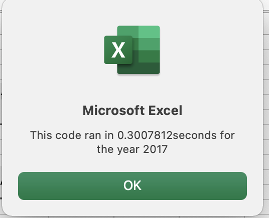
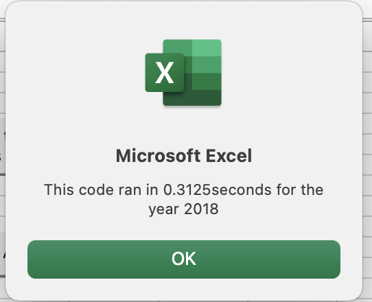
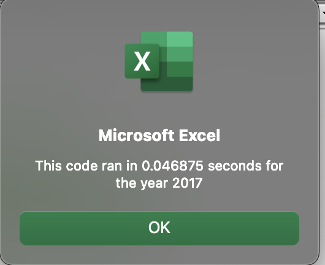
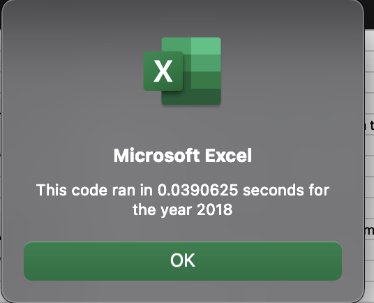
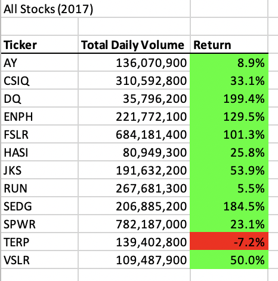
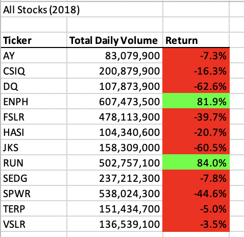

# Stock Analysis Project

## Overview

The main purpose of this project is to refactor existing code that is used to calculate and display the Total Daily Volume of a set of stocks and Return from each stock, based on the year entered, so that the same code works faster and more efficiently, when applied to a large volume of stocks.


## Analysis 

In the original code, based on the year entered, the program looped through all the rows of data in the relevant spreadsheet, and cumulated and populated the Total Daily Volume for each ticker in the Output sheet. The program also pulled the starting and ending price of each ticker and calculated and populated the return percentage, before moving to the next ticker.

This can be understood from the code snippet here.
```
 'Loop through tickers
  For i = 0 To 11
        ticker = tickers(i)
        totalVolume = 0
        
        'loop through rows in the data
        Worksheets(yearValue).Activate
        For j = 2 To RowCount
        
            'Find the total volume for the current ticker
            If Cells(j, 1).Value = ticker Then
                totalVolume = totalVolume + Cells(j, 8).Value
            End If
            
            'Find the starting price for the current ticker
            If Cells(j - 1, 1).Value <> ticker And Cells(j, 1).Value = ticker Then
                 StartingPrice = Cells(j, 6).Value
            End If
            
            'Find the ending price for the current ticker
            If Cells(j + 1, 1).Value <> ticker And Cells(j, 1).Value = ticker Then
                EndingPrice = Cells(j, 6).Value
            End If
            
        Next j
        

    
    'Output the data for the current ticker.

    Worksheets("All Stocks Analysis_original").Activate

    Cells(4 + i, 1).Value = ticker
    Cells(4 + i, 2).Value = totalVolume
    Cells(4 + i, 3).Value = EndingPrice / StartingPrice - 1
    
    Next i
    
```

In the refactored code, Output arrays were created for Tickers, Total Daily Volume, Starting and Ending price. Based on the year entered, the code ran through the rows of the relevant spreadsheet, calculated the cumulative Total Daily return, the Starting and Ending Price for each ticker and stored each value in their respective Output Array. The arrays for each ticker were tied together by the TickerIndex.

Finally the values from the arrays were displayed in the Output spreadsheet all at once. This can be seen through the code snippet here.

```

'1a) Create a ticker Index
     Dim tickerIndex As Integer
     tickerIndex = 0

    '1b) Create three output arrays
     Dim tickerVolumes(12) As Long
     Dim tickerStartingPrices(12) As Single
     Dim tickerEndingPrices(12) As Single
    
    '2a) Create a for loop to initialize the tickerVolumes to zero.
     For j = 0 To 11
        tickerVolumes(j) = 0
     Next j
        
    '2b) Loop over all the rows in the spreadsheet.
     For i = 2 To RowCount
         ticker = tickers(tickerIndex)
    
        '3a) Increase volume for current ticker
         tickerVolumes(tickerIndex) = tickerVolumes(tickerIndex) + Cells(i, 8).Value
        
        '3b) Check if the current row is the first row with the selected tickerIndex and populate Starting price for the ticker
         If Cells(i - 1, 1).Value <> ticker And Cells(i, 1).Value = ticker Then
            tickerStartingPrices(tickerIndex) = Cells(i, 6).Value
         End If
            
        
        '3c) check if the current row is the last row with the selected tickerIndex and populate Ending price for the ticker
        'If the next row’s ticker doesn’t match, increase the tickerIndex.
         If Cells(i + 1, 1).Value <> ticker And Cells(i, 1).Value = ticker Then
            tickerEndingPrices(tickerIndex) = Cells(i, 6).Value
            tickerIndex = tickerIndex + 1
        End If
        
    Next i
    
    '4) Loop through the arrays to output the Ticker, Total Daily Volume, and Return.
         Worksheets("All Stocks Analysis").Activate
         For k = 0 To 11
            Cells(4 + k, 1).Value = tickers(k)
            Cells(4 + k, 2).Value = tickerVolumes(k)
            Cells(4 + k, 3).Value = tickerEndingPrices(k) / tickerStartingPrices(k) - 1
         Next k

```

## Results

Due to the above reasons and differences in code, the refactored code ran a lot faster than the original code. The difference in the run time between the Original and the refactored code for both the years is visible from these screenshots.

### Screenshots for Original Code:





### Screenshots for Refactored code:





Both the original and refactored codes gave the same results for the stocks in 2017 and 2018. Please refer to the spreadsheet "All Stocks Analysis" in the worksheet [VBA_Challenge](VBA_Challenge.xlsm).


### Results for 2017




### Results for 2018



From the results it can be observed that the Total Daily Volume has increased for some stocks while it has reduced for some. The stock with the most significant Total Daily Volume decrease is SPWR and the one with the greatest increase is ENPH. The return percentage from all stocks have reduced between 2017 and 2018, except for the stock RUN, which has seen a significant increase in Trading Volume between the years, as well. In fact most stocks have gotten a negative return percentage in 2018.


## Summary

Refactoring code is essential to make the existing code more concise, easy to read, memory and time efficient with better performance. It makes the flow of the program better, improves the design and speed of execution and helps with easier maintenance. Refactoring improves the quality of the program overall. 

However, there is a limit to the time and resources spent on refactoring existing code. Refactoring can be a time consuming process. It does not add any new functionality. It may introduce new bugs. If the refactoring is extensive, it may be better to build the code from scratch. Therefore the extent and timing of refactoring should be determined based on schedules, budget and priorities of the project.

As far as the Stock Analysis project is concerned, since the original code had a nested 'for' loop, the program had to read all the rows of data 12 times- once for each ticker. So for example, for the year 2018, which had 3013 rows, the loop had to read 36156 rows of data (3013 * 12). Also the output worksheet had to be activated multiple times to output the calculated values for each ticker. In the refactored code, the loop for calculations had to go over all the data only once. So, for the year 2018, for example, only 3013 rows had to be read. Also the output worksheet had to be activated only once to output all the data for all the tickers, by pulling the results from the output arrays.

While the original code served the purpose and could be used for a small number of stocks, it may not have been efficient for a large number of stocks. The code took a longer time to run and the design was not as elegant. 

The refactored VBA script ran faster as seen from the analysis above. It was a much more efficient and effective solution especially when applied to a large volume of data and stocks. 